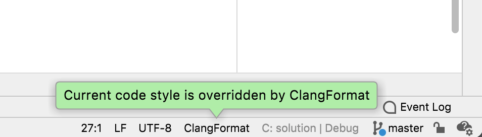

# Инструменты разработки на Си/С++

Предполагается, что на уровне пользователя вы знаете, что такое Linux. Если это не так, то необходимо прочитать [основы работы в Linux](intro.md).

## Компиляторы gcc и clang

В стандартную поставку современных UNIX-систем входит один из компиляторов: либо `gcc`, либо `clang`. В случае с Linux, по умолчанию обычно используется `gcc`, а в BSD-системах - `clang`. Далее будет описана работа с компилятором `gcc`, имея ввиду, что работа с `clang` ничем принципиально не отличается: у обоих компиляторов много общего, в том числе опции командной строки.

Кроме того, существует команда `cc`, которая является символической ссылкой на используемый по умолчанию компилятор языка Си (`gcc` или `clang`), и команда `c++`, - символическая ссылка на используемый по умолчанию компилятор для C++.

Рассмотрим простейшую программу на языке C++:
```
// файл hello.cpp
#include <iostream>

int main() {
  std::cout << "Hello, World!" << std::endl;
  return 0;
}
```

Скомпилировать эту программу можно с помощью команды:
```
> c++ -o program.jpg hello.cpp
```

Опция компилятора `-o ИМЯ_ФАЙЛА` указывает имя выходного файла, который нужно создать. По умолчанию используется имя `a.out`. Обратите внимание, что файл `program.jpg` является обычным выполняемым файлом!

### Стадии сборки программы на Си или C++

При выполнении команды `c++ -o program.jpg hello.cpp` выполняется достаточно сложная цепочка действий:

 1. Выполняется *препроцессинг* текстового файла `hello.cpp`. На этом этапе обрабатываются *директивы препроцессора* (которые начинаются с символа `#`), и получается новый текст программы. Если запустить компилятор с опцией `-E`, то будет выполнен только этот шаг, и на стандартный поток вывода будет выведен преобразованный текст программы.

 2. Выполняется *трансляция* одного или нескольких текстов на Си или C++ в объектные модули, содержащие машинный код. Если указать опцию `-c`, то на этом сборка программы будет приостановлена, и будут созданы объектные файлы с суффиксом `.o`. Объектные файлы содержат *бинарный* исполняемый код, которому в точности соотвествует некоторый текст на языке ассемблера. Этот текст можно получить с помощью опции `-S`, - в этом случае, вместо объектных файлов будут созданы текстовые файлы с суффиксом `.s`.

 3. Компоновка одного или нескольких объектных файлов в исполняемый файл, и связываение его со стандартной библиотекой Си/С++ (ну и другими библиотеками, если требуется). Для выполнения компоновки компилятор вызывает стороннюю программу `ld`.

### Программы на Си v.s. программы на C++

Компилятор `gcc` имеет опцию `-x ЯЗЫК`, для указания языка исходного текста программы: Си (`c`), C++ (`c++`) или Фортран (`fortran`). По умолчанию, язык исходного текста определяется в соответствии с именем файла: `.c`, - это программы на языке Си, а файлы, оканчивающиеся на `.cc`, `.cpp` или `.cxx`, - это тексты на языке C++. Таким образом, имя файла является существенным.

Это относится к стадиям препроцессинга и трансляция, но может вызвать проблемы на стадии компоновки. Например, используя команду `gcc` вместо `g++` (или `cc` вместо `c++`), можно успешно скомпилировать исходный текст программы на C++, но при этом возникнут ошибки на стадии связывания, поскольку компоновщику `ld` будут переданы опции, подразумевающие связывание только со стандартной библиотекой Си, но не C++. Поэтому, при сборке программ на C++ нужно использовать команду `c++` или `g++`.

### Указание стандартов

Опция компилятора `-std=ИМЯ` позволяет явным образом указать используемый стандарт языка. Рекомендуется явным образом указывать используемый стандарт, поскольку поведение по умолчанию зависит от используемого дистрибутива Linux. Допустимые имена:
 * `c89`, `c99`, `c11`, `gnu99`, `gnu11` для языка Си;
 * `c++03`, `c++11`, `c++14`, `c++17`, `gnu++11`, `gnu++14`, `gnu++17` для языка C++.

Двузначное число в имени стандарта указывает на его год. Если в имени стандарта присутствует `gnu`, то подразумеваются GNU-расширения компилятора, специфичные для UNIX-подобных систем, и кроме того, считается определенным макрос `#define _DEFAULT_SOURCE`, который в некоторых случаях меняет поведение отдельных функций стандартной библиотеки.

В дальнейшем мы будем ориентироваться на стандарт `c11`, а в некоторых задачах, где будет про это явно указано - его расширением `gnu11`.

### Директивы препроцессора

Через опции командной строки можно определять константы, которые обрабатывается на стадии препроцессинга текстового файла. Для этого используется опция `-DИМЯ=ЗНАЧЕНИЕ`. В процессе компиляции эти имена эквивалентны конструкциям `#define`.

```
#ifdef PREDEFINED_CONSTANT
static const char * StringConstant = PREDEFINED_CONSTANT;
#else
static const char * StringConstant = "Default value";
#endif
```

Данный код может быть скомпилирован с опцией, которая доопределит `PREDEFINED_CONSTANT`:

```
> cc -DPREDEFINED_CONSTANT='"Hello, World!"'
```

Обратите внимание, что если необходимо использовать символы пробелов или кавычек, то их необходимо либо экранировать, либо заключить аргумент в одинарные кавычки.

## Объектные файлы, библиотеки и исполняемые файлы

### Модуль ctypes интерпретатора Python

Рассмотрим программу на языке Си:
```
/* my-first-program.c */
#include <stdio.h>

static void do_something()
{
    printf("Hello, World!\n");
}

extern void do_something_else(int value)
{
    printf("Number is %d\n", value);
}

int main()
{
    do_something();
}
```

Скомпилируем эту программу в объектный файл, а затем - получим из него: (1) выполняемую программу; (2) разделяемую библиотеку. Обратите внимание на опцию `-fPIC`, предназначенную для генерации позиционно-независимого кода, о чем будет рассказано на одном из последующих семинарах.

```
> gcc -c -fPIC my-first-program.c
> gcc -o program.jpg my-first-program.o
> gcc -shared -o library.so my-first-program.o
```

В результате мы получим программу `program.jpg`, которая
выводит на экран строку `Hello, World!`, и *библиотеку* с именем `library.so`, которую можно использовать как из Си/C++ программы, так и динамически подгрузить для использования интерпретатором Python:

```
> python3
Python 3.6.5 (default, Mar 31 2018, 19:45:04) [GCC] on linux
Type "help", "copyright", "credits" or "license" for more information.
>>> from ctypes import cdll
>>> lib = cdll.LoadLibrary("./library.so")
>>> lib.do_something_else(123)
>>> retval = lib.do_something_else(123)
Number is 123
>>> print(retval)
14
```
Обратите внимание, что результатом работы функции `do_something_else` является какое-то загадочное число `14` (возможно, будет какое-то другое при попытке воспроизвети этот эксперимент), хотя функция возвращает `void`.

Причина заключается в том, что разделяемые библиотеки хранят только **имена** функций, но не их сигнатуры (типы параметров и возвращаемого значения).

Попытка вызвать функцию `do_something` не увенчается успехом:
```
>>> lib.do_something()
Traceback (most recent call last):
  File "<stdin>", line 1, in <module>
  File "/usr/lib64/python3.6/ctypes/__init__.py", line 361, in __getattr__
    func = self.__getitem__(name)
  File "/usr/lib64/python3.6/ctypes/__init__.py", line 366, in __getitem__
    func = self._FuncPtr((name_or_ordinal, self))
AttributeError: ./library.so: undefined symbol: do_something
```

В этом случае имя `do_something` не найдено, поскольку в исходном тексте на языке Си модификатор `static` перед именем функции явно запрещает использование функции где-либо вне текущего исходного текста.

### Просмотр таблицы символов

Для исследования объектных файлов, в том числе и скомпонованных, используется утилита `objdump`.

Опция `--syms` или `-t` отображает отдельные секции исполняемого объектного файла, которым присвоены имена - *символы*.

Некоторые имена имеют пометку `*UND*`, - это означает, что имя используется в объектном файле, но его расположение неизвестно. Задача компоновщика состоит как раз в том, чтобы найти требуемые имена в разных объектных файлах или динамических библиотеках, а затем - подставить правильный адрес.

Некоторые символы помечены как глобальные (символ `g` во втором столбце вывода), а некоторые - как локальные (символ `l`). Те символы, которые не являются глобальными, считаются *не экспортируемыми*, то есть (теоретически) не должны быть доступны извне.

## Автоматизация сборки с помощью Makefile

При разработке больших проектов, состоящих из нескольких файлов, возникает необходимость в автоматизации процесса сборки. Автоматизацией сборки занимается утилита `make`, которая использует описание сборки `Makefile`, специфичный для целевой и операционной системы и заведомо известной конфигурации. В простых случаях эти описания можно написать самостоятельно, но в более сложных, когда файлов много, или процесс сборки зависит от параметров, используется предварительная генерация файла `Makefile` с помощью более высокоуровневого инструмента, например `cmake`.

Общий формат минимального `Makefile`:

```
# могут быть комментарии
имя_цели: список зависимостей
	команда 1
	команда 2
	...
	команда N
```

Обратите внимание, что отступы перед именами команд - это строго символы табуляции, а не последовательности пробелов. Текстовые редакторы, ориентированные на написание исходного кода, обычно при работе с `Makefile` игнорируют пользовательские настройки, связанные с отступами, и используют символ табуляции.

Зависимостями могут быть определенные файлы исходных текстов, либо файлы промежуточного этапа компиляции, которые сами являются другими целям сборки. При запуске утилиты `make` проверяются даты модификации файлов, перечисленных в списке зависимостей, и выполняются команды только для тех целей, которые действительно требуют пересборки.

Целей может быть несколько, причем имена целей не обязаны совпадать с именами генерируемых ими файлов. При запуске `make` без параметров выполняется сборка той цели, которая описана самой первой, поэтому часто выделяют отдельную цель под названием `first`. Кроме того, предусматривают отдельную цель под названием `clean`, которая должна оставить после себя только конечный результат, удалив все временные файлы.

Команда `make` может использовать разные компиляторы и дополнительные параметры, которые можно переопределять через аргументы командной строки. В самом файле эти параметры используются как переменные с синтаксисом `$(имя_переменной)`.

Пример `Makefile` для программы и бибилиотеки, которые были приведены выше:

```
CC=gcc        # компилятор по умолчанию
LINK=gcc      # линковщик по умолчанию
CFLAGS=-fPIC  # флаги компилятора по умолчанию

# первая цель для сборки
first: all

# виртуальная цель для сборки всего
all: library.so program.jpg

# библиотека library.so зависит от my-first-program.o
library.so: my-first-program.o
	$(LINK) -shared -o library.so my-first-program.o

# программа тоже зависит от объектного файла
program.jpg: my-first-program.o
	$(LINK) -o program.jpg my-first-program.o

# правило для сборки объектного файла
my-first-program.o: my-first-program.c
	$(CC) -c $(CFLAGS) my-first-program.c
	
# правило для очистки проекта
clean:
	# обратите внимание на || true
	#  - подавляет ошибку, если файлы не существуют
	rm -rf *.o || true
	
# правило для очистки всего
distclean: clean
	rm -rf program.jpg library.so || true
	
```

Если требуется во время сборки определить какие-либо параметры окружения, то можно вызывать внешние команды, и использовать их вывод в качестве переменных. Для этого используется конструкция `ПЕРЕМЕННАЯ=$(shell КОМАНДА)`. Кроме того, все реализации `make` поддерживают примитивные конструкции для проверки условий `ifeq (A, B) ... endif`.

```
# пример сборки с учетом имени операционной системы

# команда uname возвращает имя операционной системы
UNAME=$(shell uname -s)
ifeq ($(UNAME), Darwin)
	OS=APPLE
endif
ifeq ($(UNAME), Linux)
	OS=LINUX
endif

platform_specific.o: platform_specific.c
	$(CC) -c $(CFLAGS) -D__$(OS)__ platform_specific.c
```

```
// platform_specific.c
#ifdef __APPLE__
// эта часть будет компилироваться только под Mac
#endif
#ifdef __LINUX__
// эта часть будет компилироваться только под Linux
#endif
```


## Проверка стиля кода

Перед публикацией кода, не важно, куда - в репозиторий или при отправке решений, необходимо следовать единому стилю кода, про который есть договоренности с теми, кто этот код будет изучать. Для автоматизации этого процесса используется утилита `clang-format`.

Для языков семейства Си нет единого стандарта, как должен быть отформатирован код. Есть несколько сложившихся в Open Source стандартов, которые задаются опцией `--style=ИМЯ`: `LLVM`, `GNU`, `Google`, `Chromium`, `Microsoft`, `Mozilla`, `WebKit`. Если указать опцию `--style=file`, то стандарт оформления будет использован из локального файла `.clang-format` (имя начинается с символа точки). Файл `.clang-format` может располагаться не только в одном  каталоге с исходным файлом, но и в любом каталоге выше по иерархии, - в этом случае будет использован первый найденный файл.

По умолчанию утилита `clang-format` выводит преобразованный исходный файл на стандартный поток вывода, опция `-i` (inplace) указывает, что необходимо перезаписать исходный файл.

Некоторые тектовые редакторы и среды разработки позволяют интегрировать `clang-format` для переопределения стиля форматирования текста.

Для редактора Emacs необходимо установить  пакет `clang-format`, и дописать в конфигурационный файл `~/.emacs` строчки:
```
(require 'clang-format)          ;; загрузка пакета clang-format
(setq clang-format-style "file") ;; опция --style=file
(global-auto-revert-mode t)      ;; автозагрузка изменений файла
```
После этого код можо переформатировать командой `cla-b`.

Среда разработки CLion начиная с версии 2021.2 определяет наличие файла `.clang-format`, и позволяет подключить переопределение стиля кода.

Для этого нужно в правом нижнем углу окна кликнуть на количество пробелов, и выбрать из всплывающего меню элемент "ClangFormat".



Переформатирование кода в CLion выполняется из меню Code > Reformat Code.

## Использование отладчика

Если скомпилировать программу с опцией `-g`, то размер программы увеличится, поскольку в ней появляются дополнительные секции, которые содержат *отладочную информацию*.

Отладочная информация содержит сведения о соответствии отдельных фрагментов программы исходным текстам, и включает в себя номера строк, имена исходных файлов, имена типов, функций и переменных.

Эти информация используется только отладчиком, и почти никак не влияет на поведение программы. Таким образом, отладочную информацию можно совмещать с оптимизацией, в том числе достаточно агрессивной (опция компилятора `-O3`).

Для запуска программы под отладчиком используется команда `gdb`, в качестве аргумента к которой указывается имя выполняемого файла или команды.

Основные команды `gdb`:
* `run` - запуск программы, после `run` можно указать аргументы;
* `break` - установить точку останова, параметрами этой команды может имя функции или пара `ИМЯ_ФАЙЛА:НОМЕР_СТРОКИ`;
* `ni`, `si` - шаг через строку или шаг внутрь функции соответственно;
* `return` - выйти из текущей функции наверх;
* `continue` - продолжить выполнение до следующей точки останова или исключительной ситуации;
* `print` - вывести значение переменной из текущего контекста выполнения;
* `layout src|regs|split` - переключение вида консольного отладчика;
* `focus src|regs` - переключениние фокуса клавиш стрелок между разными окнами.

Взаимодействие с отладчиком производится в режиме командной строки. Различные интегрированные среды разработки (CLion, CodeBlocks, QtCreator) являются всего лишь графической оболочкой, использующей именно этот отладчик, и визуализируя взаимодействие с ним.

Более подробный список команд можно посмотреть в [CheatSheet](https://www.cheatography.com/fristle/cheat-sheets/closed-source-debugging-with-gdb/).

### Удаленная отладка

Отладчик `gdb` может запускаться без интерфейса, что удобно в следующих случаях:

* явное разделение ввода-вывода и команд отладчика;
* запуск программы на удаленном компьютере через SSH, и управление отладчиком с минимальными задержками на медленном соединении;
* использование GUI для управления отладчиком.

Для запуска программы под удаленным отладчиком используется команда `gdbserver`:

```
> gdbserver localhost:12345 ./my_program ARG1 ARG2 <input >output
```

Первым параметром `gdbserver` указывается `ХОСТ:ПОРТ`, где `localhost` означает имя компьютера в сети (его может и не быть, но имя `localhost` определено всегда), а номер порта должен быть в диапазоне от 1000 до 65535, и порт должен быть не занят чем-то еще. 

После запуска `gdbserver` программа НЕ запускается, а только загружается отладчиком, и сразу же переходит в режим паузы.

Для подключения к серверу отладки нужно запустить отладчик `gdb` и выполнить команду:

```
(gdb) target remote localhost:12345
```

Для того, чтобы лишний раз не передавать бинарные файлы с отладочной информацией по сети, их можно предварительно загрузить из локальной копии с помощью команды `file`:

```
(gdb) file ./my_program
```

После того, как установлено подключение к `gdbserver`, программа все еще не выполняется и находится в режиме паузы, и запустить ее на выполнение можно с помощью команды `continue`.

В случае использования другого компьютера, а не локального хоста, дополнительный порт часто бывает не доступен, например он закрыт файрволом. В этом случае можно (и даже нужно по соображениям безопасности) использовать утилиту `ssh` для туннелирования дополнительных портов:

```
# подключаемся по ssh к remote-server
# удаленный порт 12345 будет доступен как локальный порт 56789
local-pc> ssh -L 56789:12345 user@remote-server 

# запускаем gdbserver на порту 12345
remote-server> gdbserver localhost:12345 ./my_program
```

```
# запускаем интерфейс gdb на локальном компьютере
local-pc> gdb

# подключаемся к локальному порту 56789
(gdb) target remote localhost:56789
```

### Автоматизация рутинных действий .gdbinit

Часто требуется запускать отладчик `gdb` многократно, например после внесения каких-либо изменений. Для того, чтобы не вводить команды каждый раз при запуске, можно положить рядом с программой текстовый файл `.gdbinit`, который будет выполнять команды при запуске отладчика:

```
# файл .gdbinit рядом с программой

# загружаем файл с программой
file my_program
# ставим точку останова в функцию main
break main
# переключаем интерфейс в отображение исходников
layout src
# подключаемся к удаленному серверу :12345
target remote localhost:12345
# запускаем программу до первой точки останова
continue
```

По соображениям безопасности, `gdb` не будет выполнять произвольные скрипты, которые лежат где угодно. Для этого необходимо указать отладчику каталог, который считается надежным, и тем самым сделать исключение. Для этого нужно дописать строчки в файл `~/.gdbinit`:

```
# разрешить загрузку локальных скриптов .gdbinit
# из каталога ~/i-love-akos/ и всех его подкаталогов
set auto-load safe-path ~/i-love-akos/
```


