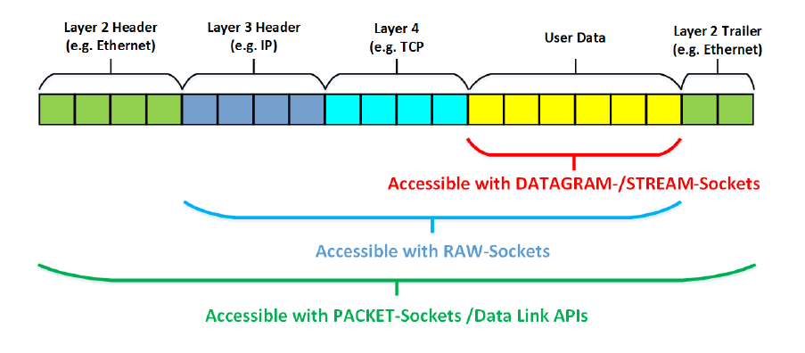

# Сетевой взаимодействие без установки соединения

## Протокол UDP

### Схема взаимодействия TCP/IP

После создания сокета типа `SOCK_STREAM`, он должен быть подключен к противоположной стороне с помощью системного вызова `connect`, либо принять входящее подключение с помощью системного выхова `accept`.

После этого становится возможным сетевое взаимодействие с использованием операций ввода-вывода.

Сетевое взаимодействие по TCP/IP (создание сокета с параметрами `AF_INET` и `SOCK_STREAM`) подразумевает, что ядро операционной системы преобразует непрерывный поток данных в последовательность TCP-сегментов, упакованных в IP-пакеты, и наоборот.

### Сокеты UDP

Механизм отправки сообщений по UDP подразумевает передачу данных без предварительной установки соединения. Сокет, ориентированный на отправку UDP-сообщений имеет тип `SOCK_DGRAM` и используется совместно с адресацией IPv4 (`AF_INET`) либо IPv6 (`AF_INET6`).

```c
// Создание сокета для работы по UDP/IP
int sockfd = socket(AF_INET, SOCK_DGRAM, 0);
```

Как и в случае с TCP, для адресация UDP подразумевает, что помимо IP-адреса хоста необходимо определиться с номером порта, который обслуживает отдельный процесс.

### Системные вызовы для передачи и приема данных без установки соединения

```c
// Отправить пакет данных
ssize_t sendto(int sockfd,                  // сокет
               const void *buf, size_t len, // данные и размер
               int flags,                   // дополнительные опции
               // адрес назначения (и его размер как для bind/connect)
               const struct sockaddr *dest_addr, socklen_t addrlen);

// Получить пакет данных
ssize_t recvfrom(int sockfd,             // сокет
                 void *buf, size_t len,  // данные и размер
                 int flags,              // дополнительные опции
                 // адрес отправителя (и размер как для accept)
                 const struct sockaddr *src_addr, socklen_t *addrlen);               
```

Cистемный вызов `sendto` предназначен для отправки сообщения. Поскольку предварительно соединение не было установлено, то обязательным является указание адреса назначения: IP-адрес хоста и номер порта.

Системный вызов `recvfrom` предназначен для приема сообщения, и является блокирующим до тех пор, пока придет хотя бы одно сообщение UDP.

Размер буфера, в который `recvfrom` должен записать данные, должен быть достаточного размера для хранения сообщения, в противном случае данные, которые не влезли в буфер, будут потеряны.

Для того, чтобы иметь возможность принимать данные по UDP, необходимо анонсировать прослушивание определенного порта с помощью системного вызова `bind`; параметры адреса для `recvfrom` предназначены только для получения информации об отправителе, и являются опциональными (эти значения могут быть NULL).


## Инструменты в Linux для отладки сетевого взаимодействия

### Сетевой ввод-вывод

Команда `nc` (сокращение от `netcat`) работает аналогично команде `cat`, но в
качестве аргумента принимает не имя файла для вывода потока данных, а пару
`хост порт`. Параметр `-u` означает отправку UDP-пакета.

Если предполагается использовать только адресацию IPv4, но не IPv6, то
используется опция `-4`.

```bash
# Пример: передать данные из in.dat в UDP-сокет на localhost
# порт 3000 и записать вывод в файл out.dat
> cat in.dat | nc -4 -u localhost 3000 >out.dat
```

### Режим Бога

Утилита `wireshark` позволяют просматривать абсолютно все пакеты на уровне от `Ethernet`, которые проходят через систему. Для этого требуются права `root`, либо настройка `Linux Capabilities` для команды `/usr/bin/dumpcap`, которая является частью `wireshark`:

```bash
sudo /usr/sbin/setcap cap_net_raw,cap_net_admin+eip /usr/bin/dumpcap
```

Кроме того, в некоторых дистрибутивах, например Debian/Ubuntu, необходимо, чтобы пользователь входил в группу `wireshark`.

Поскольку через систему проходит много сетевых пакетов, то для поиска только интересующих пакетов необходимо настроить фильтр.


### Python

Стандартная библиотека Python содержит средства работы с сокетами, которые в точности соответствуют их аналогам для POSIX.

Пример отправки UDP-сообщения:
```python
from socket import socket, AF_INET, SOCK_DGRAM

IP = "127.0.0.1"
PORT = 3000

sock = socket(AF_INET, SOCK_DGRAM)   # создание UDP-сокета
# Соединение не требуется
sock.sendto("Hello!\n", (IP, PORT))  # отправка сообщения
```

Прием UDP-сообщений:
```python
from socket import socket, AF_INET, SOCK_DGRAM

IP = "127.0.0.1"
PORT = 3000
MAX_SIZE = 1024

sock = socket(AF_INET, SOCK_DGRAM)       # создание UDP-сокета
sock.bind((IP, PORT))                    # нужно анонсировать порт  

while True:
    data, addr = sock.recvfrom(MAX_SIZE) # получить сообщение
    print("Got {} from {}", data, addr)
```

## Linux Capabilities

В классических UNIX-системах права процессов на выполнение привилегированных действий разграничиваются только на уровне доступа к файлам, либо на уровне "обычный пользователь" - "администратор". В современных ядрах Linux существует ортогональный механизм для предоставления отдельным программам определенных прав, не связанных с доступом к файлам, который называется [capabilities(7)](http://man7.org/linux/man-pages/man7/capabilities.7.html). 

Отдельному исполняемому файлу можно назначить маску привилегированных разрешений, которые распространяются только на отдельную программу (но не дочерние процессы) с помощью утилиты `setcap` (требуются права root для запуска).

Формат вызова:

```bash
> sudo setcap CAPABILITIES+FLAGS EXECUTABLE_FILE
```

Здесь `CAPABILITIES` - одно, либо несколько, разделенных запятыми, полномочий. `FLAGS` - это комбинация флагов:

* `p` - (Permitted) - полномочие разрешено для исполняемого файла;
* `i` - (Inherited) - может наследоваться при вызове `exec`;
* `e` - (Effective) - полномочие включено сразу при запуске программы.

При этом, установленные атрибуты `capabilities` не сохраняются:

* во время модификации файла (например, в результате перекомпиляции);
* при копировании или переименовании файла.

Таким образом, чтобы иметь возможность создавать и отлаживать программу, требующую дополнительные полномочия, необходимо обеспечить вызов `setcap` на этапе установки или сборки.

Так как `capabilities` это атрибуты файлов, то для их работы требуется поддержка со стороны файловой системы.
В стандартных для linux файловых системах с этим проблем нет,
но если файл находится на примонтированном разделе с неподдерживающей `capabilities` файловой системой,
то попытка установки закончится ошибкой `Failed to set capabilities on file './executable' (Operation not supported)`.

Также бывает удобным (для отладки) поставить необходимый набор полномочий на отладчик `gdb`; для корректной работы это требует дополнительно установки того же набора полномочий на командный интерпретатор `bash`. 

## Взаимодействие на уровне сетевого интерфейса

### Пакетные сокеты

Система Linux позволяет взаимодействовать с сетевыми устройствами на низком уровне, используя специальный тип сокетов: пакетные сокеты `AF_PACKET`.

Более подробно работа с сокетами на низком уровне рассмотрена в статье [Introduction to RAW Sockets](https://api.semanticscholar.org/CorpusID:136157623)

Для создания таких сокетов требуются либо права `root`, либо настройка `cap_net_raw`, в противном случае системный вызов `socket` вернет значение `-1`.

При работе с обычными TCP или UDP сокетами, ядро операционной системы полностью абстрагирует пользовательский процесс от дополнительной информации, связанной с доставкой сетевых данных. 

При работе с пакетными сокетами необходимо самостоятельно реализовывать обработку требуемых заголовков.

Существует два уровня абстракции для пакетных сокетов: передача данных, которые заворачиваются в стандартный фрейм Ethernet `(AF_PACKET, SOCK_DGRAM)`, там и полностью произвольный поток данных `(AF_PACKET, SOCK_RAW)`, который может быть использован, например, для отправки широковещательных Ethernet-фреймов.



### Бинарные заголовки сетевых протоколов

Для работы с заголовками сетевых протоколов средствами языков Си/C++ можно использовать обычные структуры.

Порядок, в котором объявлены поля структуры в тексте программы, является при этом существенным, поскольку он соответствует тому, в каком порядке хранятся данные. Кроме того, необходимо учитывать тот факт, что компиляторы оптимизируют код, выравнивания поля структур в соответствии с особенностями архитектур процессоров, и необходимо явным образом указывать использование "упакованных" структур.

**Пример:** заголовок Ethernet-кадра может быть представлен следующим образом.

```c
typedef struct {
    /* MAC-адрес получателя, 6 байт */
    uint8_t destination[6];
    /* MAC-адрес отправителя, 6 байт */
    uint8_t source[6];
    /* Тип передаваемого пакета */
    uint16_t type;
} __attribute__((__packed__)) ethernet_header_t;
```

Кроме того, необходимо помнить о том, что большинство сетевых протоколов подразумевают использование сетевого порядка байт, поэтому нужно использовать функции `htons`, `ntohs`, и др., для того, чтобы правильно представлять целочисленные значения.

### Адресация без IP-адреса

У каждого сетевого интерфейса есть имя в системе, например `eth0` или `wlan0`, которое можно посмотреть в выводе команды `ifconfig`, и *порядковый номер* (индекс). У каждого, даже не настроенного, сетевого интерфейса есть свой аппаратный адрес (MAC-адрес), размер которого обычно 6 байт.

При адресации через семейство протоколов `AF_PACKET` используется структура `sockaddr_ll`:

```c
struct sockaddr_ll {
	unsigned short sll_family;   /* Always AF_PACKET */
	unsigned short sll_protocol; /* Physical-layer protocol */
	int            sll_ifindex;  /* Interface number */
	unsigned short sll_hatype;   /* ARP hardware type */
	unsigned char  sll_pkttype;  /* Packet type */
	unsigned char  sll_halen;    /* Length of address */
	unsigned char  sll_addr[8];  /* Physical-layer address */
};
```

Поле `sll_family` должно иметь значение `AF_PACKET` (поскольку необходимо отделять этот тип адресов от других возможных `struct sockaddr`).

Для отправки низкоуровневых пакетов определенному устройству с использованием протокола Ethernet, когда используется комбинация `(AF_PACKET, SOCK_DGRAM)`, необходимо заполнять поля:

* `sll_protocol` - значение константы из `<linux/if_ether.h>`, которая определят тип пакета данных (протокол), который содержится внутри Ethernet-фрейма;
* `sll_halen` - длина адреса в байтах; для современных реализаций Ethernet это значение равно `6` (константа `ETH_ALEN` из `<linux/if_ether.h>`) ;
* `sll_ifindex` - индекс сетевого устройства; нумерация начинается с `1`, специальное значение `0` может быть использовано только для чтения (признак того, что интересуют данные из любого устройства);
* `sll_addr` - значение MAC-адреса.
* Все остальные поля заполняются драйвером устройства и должны быть инициализированы нулями.

Если используется отправка пакетов без заголовка Ethernet, то есть, используется комбинация `(AF_PACKET, SOCK_RAW)`, то достаточно указать только порядковый индекс сетевого интерфейса `sll_ifindex`.

### Управление устройствами ввода-вывода

Для управления файло-подобными устройствами ввода-вывода используется системный вызов `ioctl`, сигнатура которого такая же, как для `fcntl`: первый аргумент - это файловый дескриптор, затем целочисленная команда, а потом возможны аргументы произвольного типа, в зависимости от команды.

Набор команд для работы с сетевыми интерфейсами описан в [man 7 netdevice](http://man7.org/linux/man-pages/man7/netdevice.7.html). Многие из них могут быть выполнены только при наличии соответствующих прав (если модифицируют параметры сетевого интерфейса). С помощью GET-команд, отправляемых через системный вызов `ioctl`, можно выяснить индекс устройства по его имени, связанный с ним MAC-адрес, IP-адрес, если устройство настроено, и т. д.

